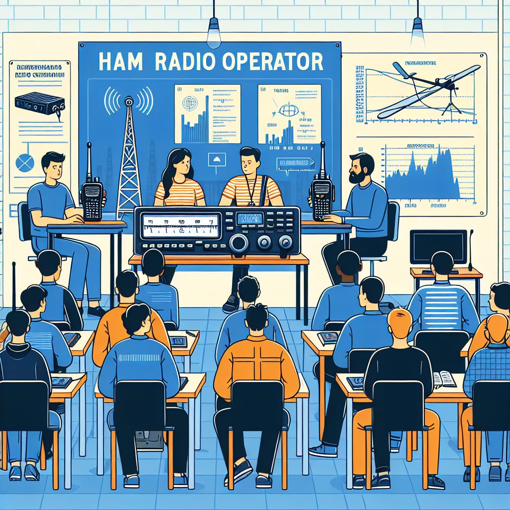

# DARMOWY KURS KRÓTKOFALARSKI
Zdobądź świadectwo operatora urządzeń radiowych, które otworzy Ci drogę do:
*	Prowadzenia łączności EME (Earth-Moon-Earth)
*	Łączności UKF z falą odbitą od meteorytów
*	Łączności z odbiciem od zorzy polarnej
*	Łączności fonicznej z drugą stroną kuli ziemskiej
*	Łączności z wykorzystaniem satelit okołoziemskich

Spotkania w __HS3__ w każdą __środę o 20:15__.\
Pierwsze spotkanie __22.01.(20+25)2__ r.
### Adress HS3
al. Wojska Polskiego 41\
80-268 Gdańsk
#### Kontakt

